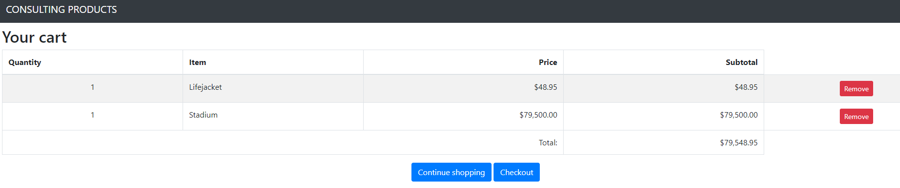

# SowardSolutions
This is a build of the demo MVC application from Adam Freeman's ASP.Net Core 3 text book. This is for demonstration purpose. 

## Link 
[https://www.apress.com/gp/book/9781484254394]
## Build Script

        dotnet new globaljson --sdk-version 5.0.103 --output SowardSolutions/ConsultingProducts
        dotnet new web --no-https --output SowardSolutions/ConsultingProducts --framework net5.0
        dotnet new sln -o SowardSolutions
        dotnet sln SowardSolutions add SowardSolutions/ConsultingProducts 
        dotnet new xunit -o SowardSolutions/ConsultingProducts.Tests --framework net5.0
        dotnet sln SowardSolutions add SowardSolutions/ConsultingProducts.Tests 
        dotnet add SowardSolutions/ConsultingProducts.Tests reference SowardSolutions/ConsultingProducts 
        
## Part 2

## Part 3
What is Entity Framework?

Enity Framework is Microsoft's Object to relational mapping (ORM) framework. 
It is used to link Dbs and web apps together.

What is a Connection String?

A connection string is a string created to connect to SQL databases from the code itself.
It contains the DB used, and the login for the DB.

What is a Database Context?

DB Context is the mapping of a specific DB with a schema the program can understand.

What is a Model Repository?

A model repository is used to reduce repetition in your DB, and is used to retrieve a sequence of DB objects.
This sequence can be queried, and any class that depends on the model repository can utilize these features.

Migration vs Scaffolding?

Migration is the compiler creating DB tables for you with the context provided.
Scaffolding is the compiler creating code for cshtml and html documents with the context.

## Part 3
Totally forgot to snip seeding the database.

## Part 4

## Part 5

Divided the products by type 

## Part 6
Started to build the first parts of a shopping cart, you'll notice in the prior pictures that each product has an add to cart button. The following page shows the shopping cart.

## Part 7 
Cart is complete and is able to add and remove items to purchase

## Part 8
You can now see a subtotal of the purchase in the top right of the application. 

##Part 9
After clicking checkout in cart, you proceed to checkout screen

## Part 10 
Then clicking "complete order" sends you to the thank you screen

